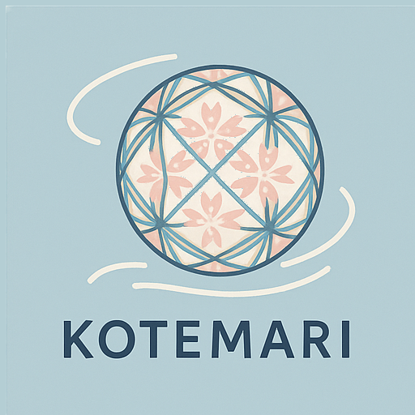

<div align="center">
  
</div>

# kotemari-ts（コテマリTS）

🌸 **LLMアプリのための魔法のコンテキスト管理ライブラリ！** 🌸

kotemari-tsは、LLM（大規模言語モデル）アプリのための「文脈生成・キャッシュ・管理」を、楽しく・かんたん・確実にしてくれるTypeScript製ライブラリです。

---

## 🥇 このプロジェクトの目的
- LLMアプリ開発で「安定した文脈（コンテキスト）」を簡単に生成・再利用したい
- ファイル依存関係を解析し、毎回同じ入力で同じ文脈を返すことでLLMの一貫性・再現性を高めたい
- 文脈長や依存関係の管理を自動化し、開発者の負担を軽減したい

---

## 🎉 kotemari-tsの魅力
- **いつでも同じ文脈！** 依存ファイルやコードが同じなら、毎回同じコンテキストが生成されます。
- **キャッシュで高速化！** 以前生成した文脈を再利用し、LLMアプリの応答速度UP。
- **モード切替で柔軟対応！** ローカルLLM/クラウドLLMの切替だけで最適な文脈長に自動調整。
- **多言語対応設計！** TypeScriptはもちろん、Pythonなど他言語プロジェクトにも拡張可能。
- **シンプルAPI！** 小さなスクリプトから大規模アプリまで、すぐ導入できます。
- **使って楽しい！** 「わかりやすい」「開発がはかどる」そんな文脈管理を目指しました。

---

#### LLMのコンテキスト長と最適化ポリシー

近年のLLM（大規模言語モデル）は、入力できるコンテキスト長（トークン数）に制限があります。kotemari-tsはこの課題を次のように解決します：

- 利用するLLM（ローカル/クラウド、無料/有料）に合わせて最大コンテキスト長を柔軟に設定可能
- 必要なファイルと依存関係だけを抽出し、無駄のない最適な文脈文字列を自動生成
- 動作方針ごとに最適化モードを選択可能：
    - **積極モード（Aggressive）**：できる限り多くの文脈（依存ファイルや情報）を含める
    - **バランスモード（Balanced）**：重要な部分を優先しつつ、文脈量とコストのバランスを取る
    - **保守モード（Conservative）**：必要最小限の文脈だけを含めてコストや速度を重視
- キャッシュ一貫性：同じ入力・依存関係なら常に同じ文脈を生成し、再現性とキャッシュ効率を両立

これらの特徴により、kotemari-tsはLLM活用のための効率的かつ信頼性の高い文脈管理を実現します。

---

## 🌟 主な機能
- 依存ファイル内容ベースの安定した文脈生成
- 依存リストの重複排除＆ソートで一貫性抜群
- モードごとに文脈長を自動調整
- 効率的なキャッシュキー生成・管理
- 豊富なAPIで高度なカスタマイズもOK
- ファイル監視による自動再解析

---

## 🚀 インストール方法
```sh
npm install kotemari-ts
# または
yarn add kotemari-ts
# または
pnpm add kotemari-ts
```

### 動作環境
- Node.js 18以上推奨
- TypeScriptプロジェクトで動作

---

## 📂 ディレクトリ構成
- `src/` : ライブラリ本体
- `test/` : テストコード
- `docs/` : ドキュメント

---

## 🧙‍♀️ 使い方サンプル
```typescript
import { Kotemari } from 'kotemari-ts';

const kotemari = new Kotemari({
  projectRoot: './src',
  mode: 'cloudLLM', // または 'localLLM'
});

await kotemari.analyzeProject();
const context = await kotemari.getContext('main.ts');
console.log(context);
```

---

## 🛠️ 開発・コントリビュート方法
1. このリポジトリをクローン
2. `pnpm install` で依存関係をインストール
3. テスト実行: `pnpm test`
4. Lint: `pnpm lint`
5. ビルド: `pnpm build`

Issue・PR歓迎！

---

## ❓ よくある質問（FAQ）
- **Q: TypeScript以外のプロジェクトでも使えますか？**
  - A: コア機能はTypeScript向けですが、拡張により他言語も対応可能です。
- **Q: LLMごとに文脈長を変えたい場合？**
  - A: `mode`オプション（`cloudLLM`/`localLLM`）で自動調整できます。
- **Q: プロジェクトが大規模でも大丈夫？**
  - A: キャッシュや効率的な解析で高速動作しますが、最終的な文脈長はLLMの制限に依存します。

---

## 📖 詳細ドキュメント
- [APIリファレンス](./docs/api_reference.md)
- [コンセプト](./docs/concept.md)
- [実践例](./docs/usage_examples.md)

---

## 📝 ライセンス
MIT

---

## 🙏 作者・コントリビューター
kotemari-ts contributors

## 📝 ライセンス
MIT
